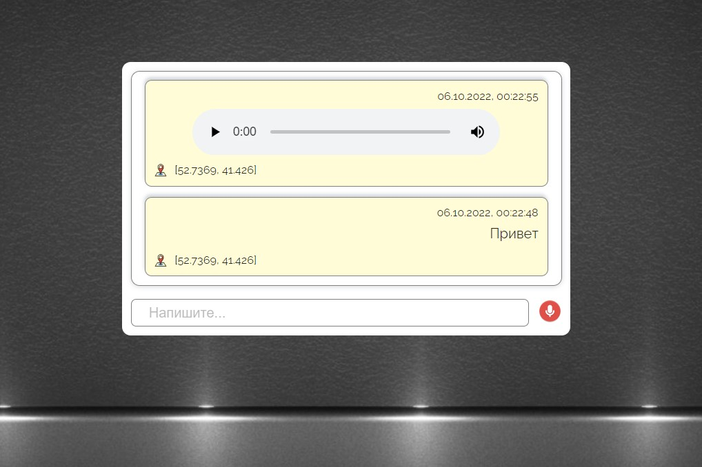
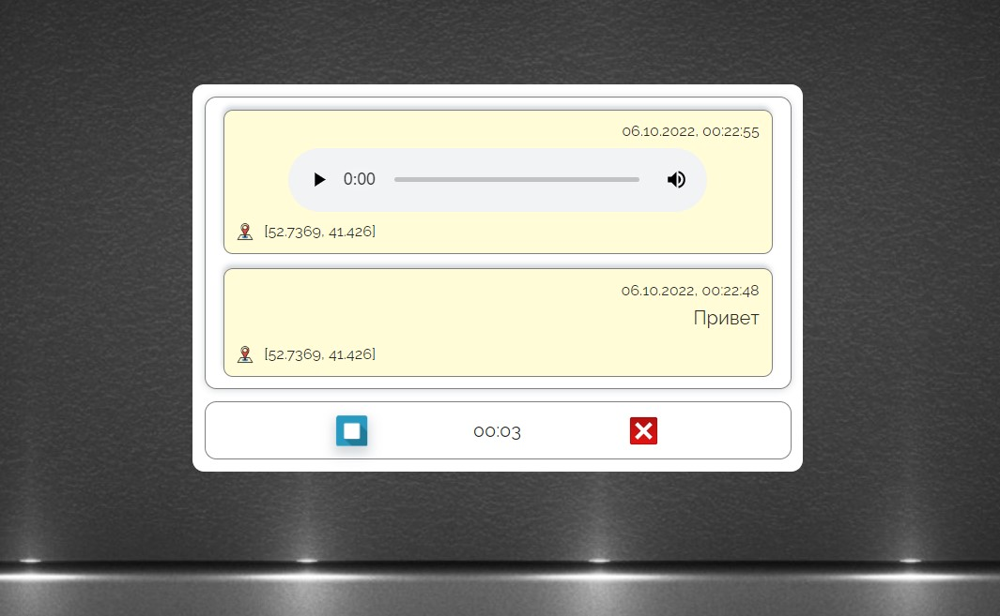

[GitHub Pages](https://lekseff.github.io/Timeline/)

## Timeline

Проект "Timeline" - некая лента постов человека, где он может прикреплять текстовые посты, а также записывать аудио в привязке к своей геопозиции.

Затем посты с текстом можно просматривать, посты с аудио - прослушивать.

Записи отображаются сверху вниз, наверху самая последняя.

Первая запись - пример аудио-записи (при нажатии на кнопке Play происходит проигрывание аудио-записи).

Вторая запись - пример текстовой записи.

Для каждой записи указаны координаты, где сделана запись.

---                                                                        
При нажатии на иконку микрофона в поле ввода текста начните записывать аудио (если недоступно API, либо пользователь не выдал прав - появится соответствующее сообщение необходимости выдачи прав).

Вид при записи аудио:

