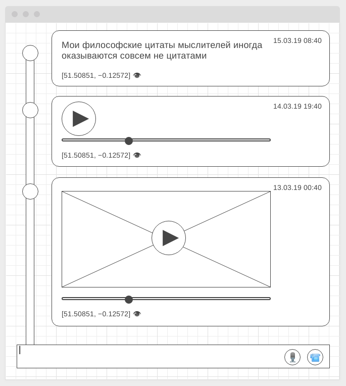

[GitHub Pages](https://lekseff.github.io/Timeline/)

### Общая легенда

Вам предстоит создать проект "Timeline" - некую ленту постов человека, где он может прикреплять текстовые посты, а также записывать аудио и видео в привязке к своей геопозиции.

Затем посты с текстом можно просматривать, посты с аудио - прослушивать, посты с видео - "проигрывать".

Как это примерно должно выглядеть:

Записи отображаются сверху вниз, наверху самая последняя.

Первая запись - пример текстовой записи.

Вторая запись - пример аудио-записи (при нажатии на кнопке Play происходит проигрывание аудио-записи).

Третья запись - пример видео-записи (при нажатии на кнопке Play происходит проигрывание видео-записи).

Для каждой записи указаны координаты, где сделана запись.

---

### Задача 1. Текстовые записи с координатами

При создании текстовой записи (пользователь вводит текст в нижнее поле ввода и нажимает Enter) запросите координаты пользователя (через Geolocation API). Если координаты доступны, то добавьте сообщение в Timeline. Если же координаты не доступны - выведите пользователю соответствующее предупреждение с помощью модального окна и предложите указать координаты вручную (в реальном приложении, вы, конечно, будете использовать провайдера карт, но мы пока поступим именно так):

Напишите авто-тест для функции, которая будет обрабатывать пользовательский ввод координат, при этом функция корректно должна обрабатывать следующие ситуации (и выводить объект содержащий широту и долготу):
1. 51.50851, −0.12572 (есть пробел)
1. 51.50851,−0.12572 (нет пробела)
1. [51.50851, −0.12572] (есть квадратные скобки)

При несоответствии формата функция должна генерировать исключение, которое должно влиять на валидацию поля (валидацию мы проходили).

---

### Задача 2. Аудио-записи с координатами* (задача со звёздочкой)
                                                                                   
Важно: эта задача не является обязательной. Её (не)выполнение не влияет на получение зачёта по ДЗ.

При нажатии на иконку микрофона в поле ввода текста начните записывать аудио (если недоступно API, либо пользователь не выдал прав - выводите соответствующее всплывающее окно о необходимости выдачи прав или о использовании другого браузера).

Вид при записи аудио:

Т.е. иконка микрофона и камеры пропадают, появляются иконки "Ok" и "Отмена", между ними - таймер, показывающий, сколько секунд аудио записано.

По нажатию кнопки "Оk" (галочка) запись завершается, далее определяются гео-координаты, если они не доступны, выводится всплывашка с просьбой ввести вручную.

После чего запись добавляется в виде `<audio>` в Timeline. При нажатии "Play" запись должна воспроизводится.

Обратите внимание, что при записи звук дублироваться не должен.